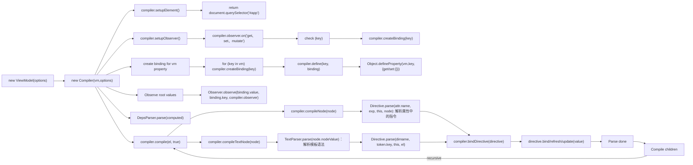

这是 `Vue` 发布的第一个版本，实现的功能有：
1. 数据双向绑定
2. 常用指令：`v-model`、`v-on`、`v-show` 等等
3. 过滤器

## 准备

为了方便跟踪代码中的一些逻辑，本人把官方的 `Todos` 示例改成了 `webpack` 开发环境，方便在源码中添加断点调试。

```bash
git clone git@github.com:liuweiGL/vue-debug-v0.6.0.git
npm install
npm start
```

## 源码结构

```
vue-0.6.0\src
├── binding.js           收集指令实例与计算属性依赖
├── compiler.js          核心模块：扫描 DOM 节点解析指令、表达式，为 ViewModel 编译 bindings
├── config.js            配置文件
├── deps-parser.js       依赖解析
├── directive.js         DOM 中的单个 directive 实例
├── directives           指令目录
|  ├── if.js             v-if 指令
|  ├── index.js          v-show、v-html 等简单指令集
|  ├── model.js          v-model 指令
|  ├── on.js             v-on 指令
|  └── repeat.js         v-repeat 指令
├── emitter.js           事件订阅发布类
├── exp-parser.js        模板中的表达式解析
├── filters.js           常用的过滤器集合
├── main.js              类库入口，添加全局方法，比如：Vue.component()、Vue.filter() 等
├── observer.js          观察对象的属性变动，主要是为对象的 __observer__（Emitter实例）添加 get、set、mutate 事件
├── text-parser.js       解析 {{ }} 模板语法
├── transition.js        使用 transition 事件实现过渡效果
├── utils.js             工具函数集合
└── viewmodel.js         真正的 Vue 工厂类，拥有 $on、$set、$emit 等原型方法
```

可以看到最初的 `Vue` 还是比较简单的，下面我们进行每个功能的实现细节分析。

## MVVM

总所皆知，`MVVM` 是当前非常流行的一种软件架构模式，它让我们摆脱 `Jquery` 的 `DOM` 面条操作与混乱的事件监听依赖，以数据驱动的方式开发应用。


从图中我们可以看到整个应用分为三个模块：`View 视图`、`Model 模型`、`ViewModel 视图模型` 三个模块，其中 `View` 与 `Model` 都只跟 `ViewModel` 模块进行通信：

* 当我们发送一条请求获得新数据时 `Model` 发生改变，这个时候 $ M \\Rightarrow VM \\Rightarrow V $，即数据源更改自动更新视图。
* 当用户输入内容时 `View` 发生改变，这个时候  $ V \\Rightarrow VM \\Rightarrow M $，即视图更改自动同步数据源。

> View 视图：HTML 模板   
> Model 模型：数据源（参考后端的 `Entity`、` Domain` 等概念）   
> ViewModel 视图模型：负责视图与数据源的同步（[绑定器]([https://zh.wikipedia.org/wiki/MVVM](https://zh.wikipedia.org/wiki/MVVM)
)）

## 数据双向绑定

作为 `MVVM` 模式的典型应用，`Vue` 就是通过 `数据双向绑定` 来实现 $ VM $ 模块的。

其内部基本流程：


由于第一版中并不存在 `computed` 计算属性，`compiler` 模块只会去解析 HTML 模板，把其中出现的数据项作为计算属性为其创建 `binding`，并维护属性之间的依赖关系。

下面，我们一起看看 `响应式数据` 的实现细节：



